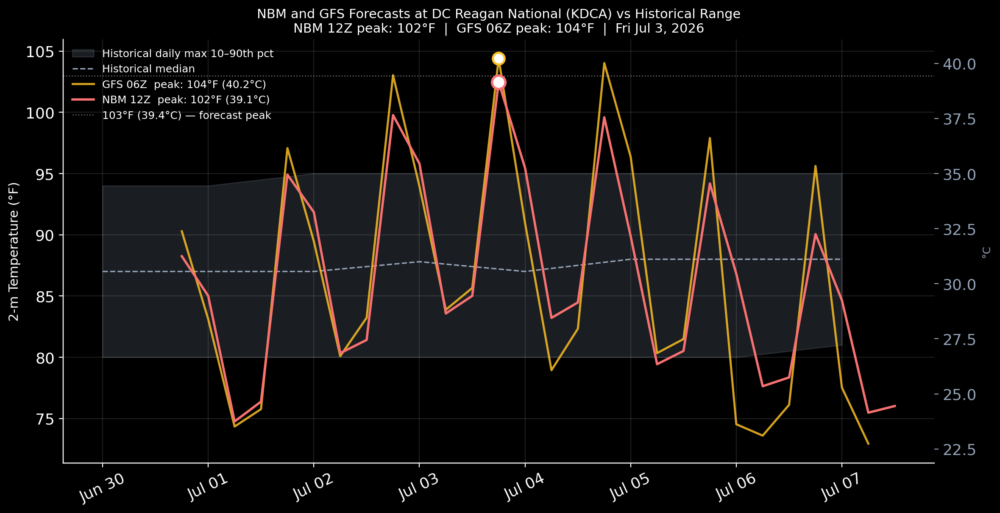
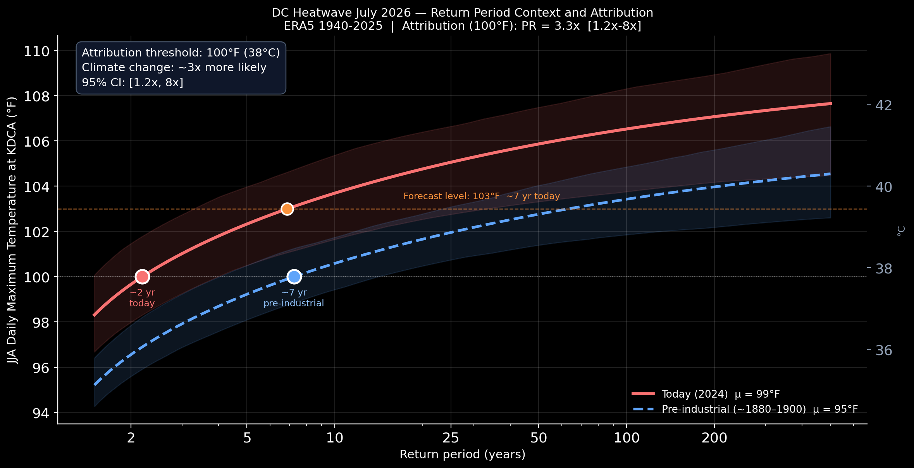

# DC Heatwave — July 2026

**Event:** NBM (Jun 30 12Z) and GFS (Jun 30 06Z) forecasts both showing temperatures reaching 103–104°F at Reagan National Airport (KDCA) on Friday July 3, 2026.

**Questions:** How rare is a 100°F+ day at KDCA in today's climate — and how much rarer was it before anthropogenic warming? Where does the 103°F forecast level sit on the return period curve?

## Key Results

Attribution threshold: **100°F (37.8°C)**  |  ERA5 α = 1.15 °C/°C GMST

| Metric | ASOS (1973–2025) | ERA5 (1940–2025) |
|--------|-----------------|-----------------|
| NS-GEV α (°C per °C GMST) | 0.568 | 1.148 |
| PR | 1.88  [0.45, 7.15] | 3.31  [1.24, 8.31] |
| FAR | 0.47  [−1.21, 0.86] | 0.70  [0.19, 0.88] |

**Synthesized PR (precision-weighted):** 2.67 — χ²/dof = 0.43 (consistent)

### Return period under ERA5 NS-GEV

| Scenario | ΔGMST | Return period | PR vs pre-industrial |
|----------|-------|--------------|----------------------|
| Pre-industrial | −1.5°C | 7 yr | 1.0× |
| Today (2024) | +0.0°C | 2 yr | 3.3× |
| +0.5°C (~2035–40) | +0.5°C | 2 yr | 4.3× |
| +1.0°C (~2050–60) | +1.0°C | 1 yr | 5.1× |
| +1.5°C (~2070–80) | +1.5°C | 1 yr | 5.9× |

**Stationary return period — 103°F forecast level:** ~20 yr (no trend); ~7 yr in today's warmed climate (NS-GEV).

## Data

- **ASOS observations:** KDCA (1973–2025) — NOAA / Iowa State Mesonet
- **ERA5 reanalysis:** 1940–2025 — Copernicus / ECMWF
- **NBM forecast:** Init 2026-06-30 12Z — NOAA NODD via Herbie
- **GFS forecast:** Init 2026-06-30 06Z — NOAA NODD via Herbie
- **GMST:** NASA GISTEMP v4, J-D annual mean

## Methodology

Philip et al. (2020) World Weather Attribution protocol — NS-GEV with GMST as covariate in μ. Bootstrap CIs (n=500). Independent analysis, not peer-reviewed.

## Notebook

[dc_heatwave_2026_analysis.ipynb](dc_heatwave_2026_analysis.ipynb)

## Figures

