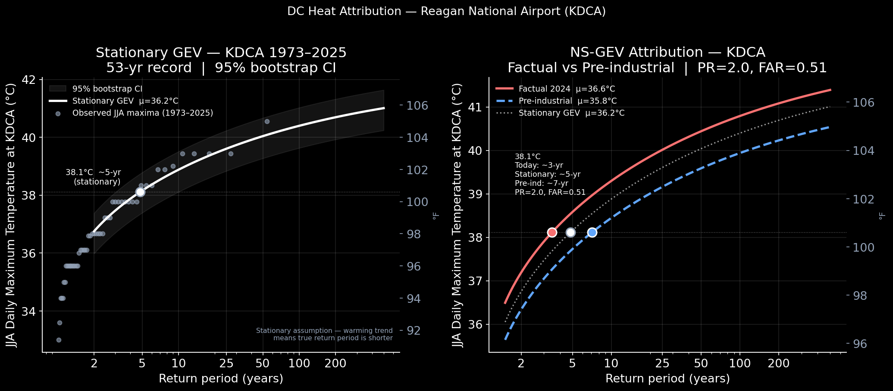

# DC Heatwave — July 2026

**Event:** GFS forecast showing temperatures approaching 38°C (100°F) at Reagan National Airport (KDCA) around July 2–3, 2026.

**Question:** How rare is a 38°C day at KDCA in today's climate — and how much rarer was it before anthropogenic warming?

## Key Results

| Metric | Value |
|--------|-------|
| GFS forecast peak | 38.0°C (100.4°F) — Jul 03 18 UTC |
| Stationary return period | ~4-yr |
| NS return period — today | ~3-yr |
| NS return period — pre-industrial | ~6-yr |
| α (°C per °C GMST) | 0.568 |
| PR | 1.99  [0.41, 9.14] |
| FAR | 0.50  [−1.46, 0.89] |

Climate change has roughly **doubled** the annual probability of a 38°C day at KDCA. A shift of 0.85°C in the distribution center — driven by 1.5°C of global warming amplified locally at a rate of 0.57 — was enough to cut the return period from ~6 to ~3 years.

## Data

- **ASOS observations:** KDCA (1973–2025) — NOAA / Iowa State Mesonet
- **GFS forecast:** Init 2026-06-27 00Z — NOAA AWS archive via Herbie
- **GMST:** NASA GISTEMP v4, J-D annual mean

## Notebook

[dc_heatwave_2026_analysis.ipynb](dc_heatwave_2026_analysis.ipynb)

## Figures

